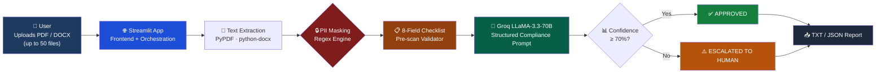
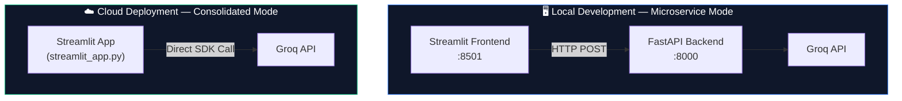
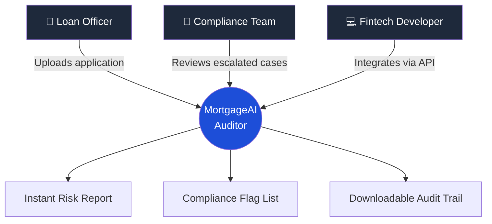
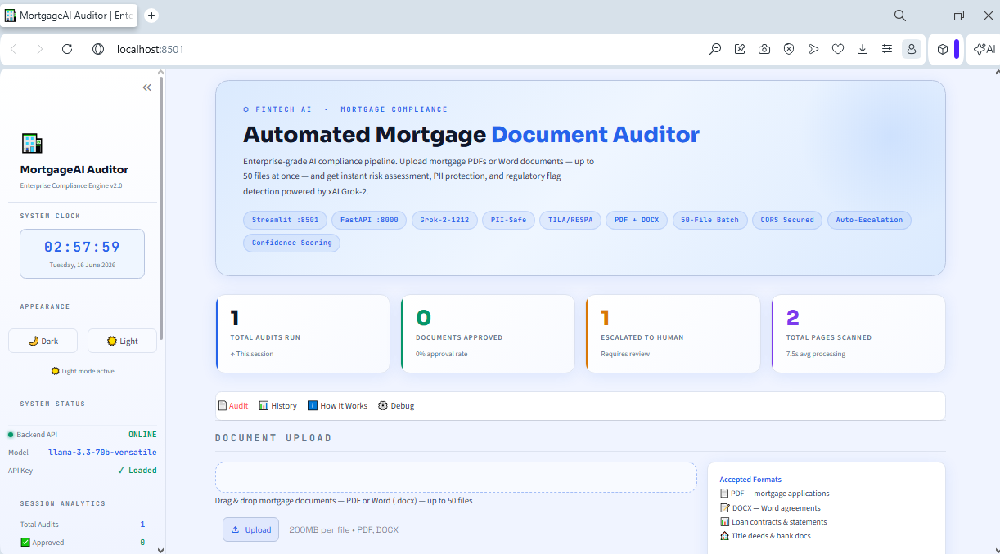
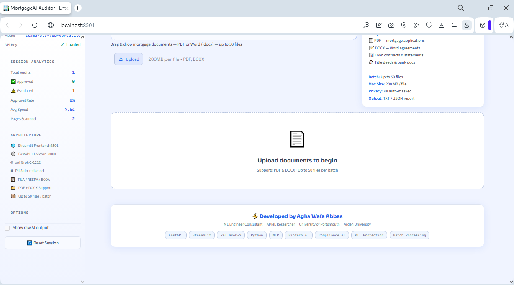
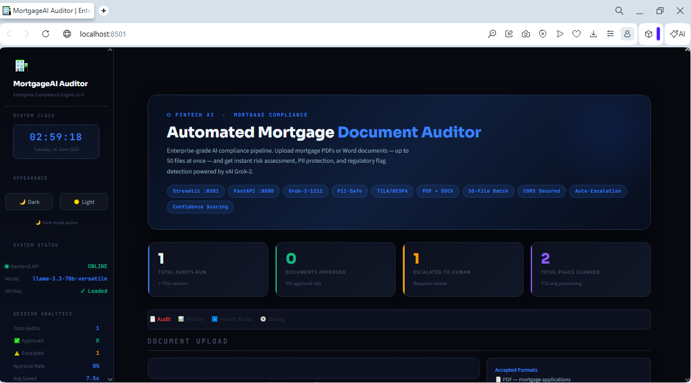
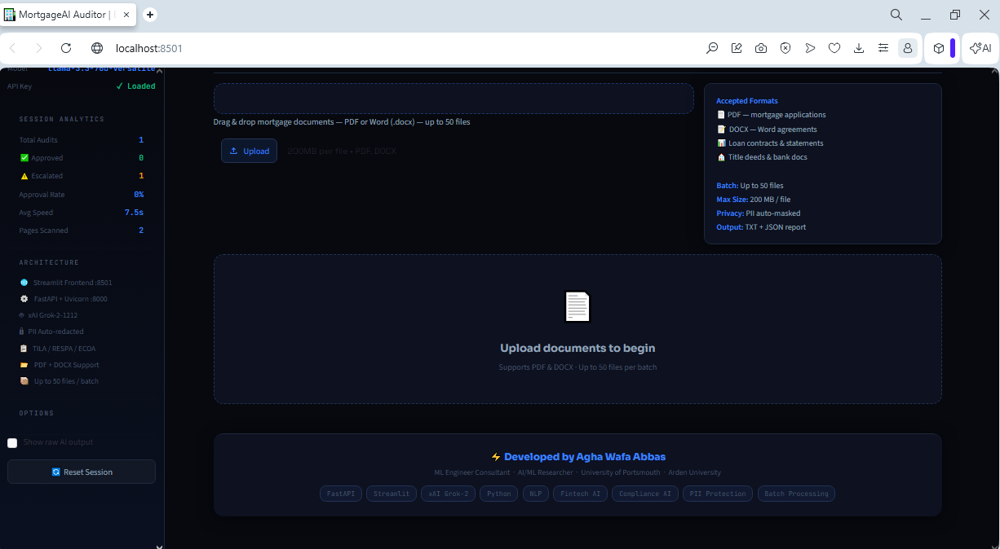
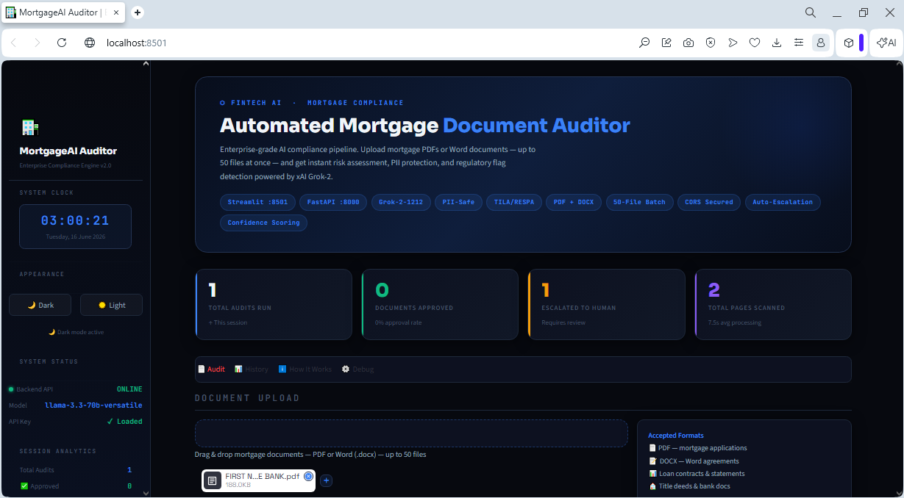
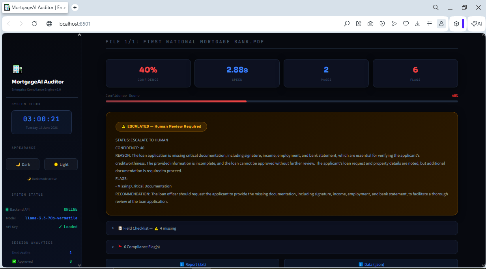

<div align="center">

# 🏦 MortgageAI Auditor

### Enterprise-Grade AI Compliance Pipeline for Mortgage Document Underwriting

[](https://mortgage-ai-auditor-hhhf29uvhwa2w3lb7jmrnj.streamlit.app/)
[](https://www.python.org/)
[](https://groq.com/)
[](#-license)

**An automated, privacy-first AI auditor that reviews mortgage documents in seconds — flagging compliance risks, masking sensitive data, and routing decisions to human reviewers when confidence is low.**

[Live Demo](https://mortgage-ai-auditor-hhhf29uvhwa2w3lb7jmrnj.streamlit.app/) · [Features](#-key-features) · [Architecture](#-system-architecture) · [Use Cases](#-use-cases--target-users) · [Setup](#-getting-started)

</div>

<br>

---

## 📖 Overview

**MortgageAI Auditor** is a full-stack AI compliance system designed to automate one of the most time-consuming and error-prone tasks in retail banking: **mortgage document review**.

Traditionally, a loan officer manually reads 30–50 pages per application — checking signatures, verifying income, cross-referencing bank statements, and ensuring compliance with federal lending regulations. This process can take **hours per file** and is prone to human fatigue and inconsistency.

This system compresses that entire review into **under 10 seconds**, using a large language model (Groq's LLaMA-3.3-70B) wrapped in a structured compliance engine that performs:

- Automated text extraction (PDF & DOCX)
- PII redaction *before* any data reaches the AI
- An 8-point regulatory field checklist
- AI-driven risk scoring with a confidence threshold
- Automatic escalation to a human reviewer when the AI is uncertain

> **In short:** This is not a chatbot wrapper. It is an **AI automation pipeline** — the AI is invisible infrastructure behind a business workflow, not a conversational interface the end user talks to.

---

## 🎯 Why This Project Exists

| Problem in Traditional Mortgage Underwriting | How This System Solves It |
|---|---|
| Manual review takes 30–60 minutes per document | AI completes a full audit in **2–10 seconds** |
| Loan officers can miss missing signatures or fields | An automated **8-field checklist** runs before AI review |
| Sensitive data (SSN, account numbers) handled carelessly | **PII is regex-masked** before it is sent anywhere |
| Inconsistent approval decisions between officers | AI applies the **same structured criteria** every time |
| No confidence indicator on manual decisions | Every decision ships with a **0–100% confidence score** |
| Risky or borderline files get rubber-stamped | Auto-escalation forces **human review below 70% confidence** |

---

## ✨ Key Features

<table>
<tr>
<td width="50%" valign="top">

### 📂 Document Intelligence
- Supports **PDF** and **Word (.docx)** uploads
- Batch processing — up to **50 files** at once
- Automatic text extraction (PyPDF / python-docx)
- File size, type, and page-count detection

### 🔒 Privacy & Security
- Regex-based **PII auto-masking** (SSN, card numbers, phone, email, account numbers)
- No raw sensitive data ever reaches the AI model
- No document content is persisted or stored
- API keys managed via environment secrets, never hardcoded

### 📋 Compliance Engine
- 8-point mandatory field checklist (name, date, loan amount, signature, etc.)
- Maps findings to **TILA, RESPA, ECOA, HMDA, FCRA** standards
- Structured, parseable AI output format (STATUS / CONFIDENCE / FLAGS / RECOMMENDATION)

</td>
<td width="50%" valign="top">

### 🤖 AI Risk Scoring
- Powered by **Groq LLaMA-3.3-70B-Versatile**
- Returns a **confidence score (0–100%)** per document
- **Auto-escalation rule:** any result below 70% confidence is forcibly routed to "Human Review," even if the model said "Approved"

### 📊 Analytics & Reporting
- Live session dashboard: approval rate, average speed, total pages audited
- Full audit history table per session
- One-click **TXT and JSON report downloads** per document

### 🎨 Interface
- Dark / Light theme toggle
- Live system clock (auto local time)
- Animated progress pipeline during audit
- Responsive enterprise-grade UI (Sora + Space Grotesk + JetBrains Mono typography)

</td>
</tr>
</table>

---

## 🏗️ System Architecture



### Deployment Topologies

This project ships with **two architectures**, intentionally:



| Mode | Stack | Purpose |
|---|---|---|
| **Local / Microservice** | Streamlit + FastAPI + Uvicorn | Demonstrates separation of concerns, REST API design, and CORS-secured service boundaries — the architecture a production banking system would actually use |
| **Cloud / Consolidated** | Single Streamlit file | Optimized for free-tier cloud hosting (Streamlit Community Cloud only runs one process), used for the public live demo |

---

## 🧩 Use Case Diagram



---

## 🌍 Use Cases & Target Users

| Sector | Who Uses It | What They Get |
|---|---|---|
| **Community & Regional Banks** | Loan officers, underwriters | Faster first-pass review of mortgage applications before manual sign-off |
| **Mortgage Origination Firms** | Processing teams | Bulk audit of incoming applications (batch mode, up to 50 files) |
| **Fintech & Lending Startups** | Engineering teams | A reference architecture for AI-assisted underwriting pipelines |
| **Compliance & Risk Departments** | Compliance officers | A consistent, auditable, confidence-scored second opinion on every file |
| **Academic / Research** | ML & fintech researchers | A case study in human-in-the-loop AI design with auto-escalation safeguards |

> ⚠️ This system is a **decision-support tool**, not a decision-making authority. Every output is designed to *assist*, not *replace*, a licensed human underwriter.

---

## ⚙️ How It Works — Step by Step

| Step | Component | Description |
|:--:|---|---|
| **1** | **Upload** | User submits a PDF or DOCX file (or up to 50 in a batch) through the Streamlit interface |
| **2** | **Extraction** | `PyPDF` or `python-docx` extracts raw text and page/paragraph counts |
| **3** | **PII Masking** | Regex patterns redact SSNs, card numbers, phone numbers, emails, and account numbers *before* anything is sent to the AI |
| **4** | **Checklist Scan** | The system verifies 8 required fields: applicant name, date, loan amount, property address, signature, income, employment, bank statement |
| **5** | **AI Audit** | The redacted text + checklist result is sent to **Groq's LLaMA-3.3-70B** with a structured compliance prompt |
| **6** | **Risk Decision** | The model returns `STATUS`, `CONFIDENCE`, `REASON`, `FLAGS`, and `RECOMMENDATION` in a strict parseable format |
| **7** | **Auto-Escalation** | If confidence < 70%, the result is force-converted to `ESCALATE TO HUMAN`, regardless of the model's original verdict |
| **8** | **Reporting** | The user can download a full audit trail as `.txt` or `.json`, and view session-wide analytics |

---

## 🛠️ Tech Stack

<div align="center">

| Layer | Technology |
|---|---|
| **Frontend / UI** | Streamlit, custom CSS (Sora, Space Grotesk, JetBrains Mono) |
| **Backend (local mode)** | FastAPI, Uvicorn, CORS Middleware |
| **AI Inference** | Groq Cloud — LLaMA-3.3-70B-Versatile |
| **Document Parsing** | PyPDF, python-docx |
| **Security** | Regex PII redaction, python-dotenv, Streamlit Secrets |
| **Language** | Python 3.12 |

</div>

---

## 🚀 Getting Started

### Option A — Run Locally (Microservice Mode)

```bash
# 1. Clone the repository
git clone https://github.com/Aghawafaabbass/mortgage-ai-auditor.git
cd mortgage-ai-auditor

# 2. Create a virtual environment
python -m venv venv
venv\Scripts\activate        # Windows
# source venv/bin/activate   # macOS/Linux

# 3. Install dependencies
pip install -r requirements.txt

# 4. Add your Groq API key to a .env file
echo GROQ_API_KEY=gsk_your_key_here > .env

# 5. Run the app
streamlit run streamlit_app.py
```

### Option B — Use the Live Demo

No installation needed:

🔗 **[https://mortgage-ai-auditor-hhhf29uvhwa2w3lb7jmrnj.streamlit.app/](https://mortgage-ai-auditor-hhhf29uvhwa2w3lb7jmrnj.streamlit.app/)**

---

## 📸 Screenshots

<div align="center">

| Setup & Local Run | Application Console |
|---|---|
|  |  |

| Code Structure | Audit Dashboard |
|---|---|
|  |  |

| Compliance Result | Light Mode UI |
|---|---|
|  |  |

</div>

---

## 📈 System Analysis & Design Rationale

**Why a confidence threshold of 70%?**
Mortgage underwriting carries real financial and legal risk. Rather than letting an LLM make a binary approve/reject call autonomously, the system treats anything under 70% confidence as inherently uncertain and routes it to a human — a deliberate **human-in-the-loop safety design**, not a limitation.

**Why mask PII before the AI call, not after?**
Sending unredacted SSNs or account numbers to any third-party API — even a reputable one — is an unnecessary data exposure risk. Masking happens at the parsing layer, *before* the network call, so sensitive data never leaves the local extraction step.

**Why two separate architectures (FastAPI vs. single-file)?**
Free-tier cloud hosts typically support only a single running process. Maintaining a microservice version locally demonstrates realistic backend separation (the way a bank's actual systems would be deployed — with isolated, independently scalable services) while the consolidated version proves the same business logic works without that overhead — a practical lesson in **deployment-constrained architecture decisions**.

---

## 🔮 Future Roadmap

- [ ] **OCR support** for scanned/image-based PDFs (Tesseract / Azure Document Intelligence)
- [ ] **Multi-language document support** (Spanish, Urdu, French mortgage documents)
- [ ] **Database persistence** (PostgreSQL) for audit history beyond a single session
- [ ] **Role-based authentication** (Loan Officer vs. Compliance Reviewer views)
- [ ] **Webhook integration** with loan origination systems (Encompass, Calyx)
- [ ] **Explainability layer** — highlight exact source text driving each AI flag
- [ ] **Fine-tuned model** trained specifically on labeled mortgage compliance data
- [ ] **Multi-model ensemble** (cross-checking Groq output against a second LLM for higher-stakes files)

---

## ⚠️ Disclaimer

This project is an **educational and portfolio demonstration** of an AI-assisted compliance pipeline. It is **not certified for production use in regulated financial institutions** and has not undergone formal regulatory, security, or legal review.

- This tool does **not** constitute legal, financial, or compliance advice.
- AI-generated assessments may contain errors and **must always be verified by a licensed human professional** before any lending decision is made.
- No warranty is provided regarding the accuracy, completeness, or fitness of AI outputs for real-world underwriting.
- Sample documents used in testing/demos are **entirely fictional** and do not represent real individuals or institutions.

---

## 📜 License

This project is licensed under the **MIT License** — see below for details.

```
MIT License

Copyright (c) 2026 Agha Wafa Abbas

Permission is hereby granted, free of charge, to any person obtaining a copy
of this software and associated documentation files (the "Software"), to deal
in the Software without restriction, including without limitation the rights
to use, copy, modify, merge, publish, distribute, sublicense, and/or sell
copies of the Software, subject to the following conditions:

The above copyright notice and this permission notice shall be included in
all copies or substantial portions of the Software.

THE SOFTWARE IS PROVIDED "AS IS", WITHOUT WARRANTY OF ANY KIND, EXPRESS OR
IMPLIED, INCLUDING BUT NOT LIMITED TO THE WARRANTIES OF MERCHANTABILITY,
FITNESS FOR A PARTICULAR PURPOSE AND NONINFRINGEMENT.
```

---

## 👤 Author

<div align="center">

### Agha Wafa Abbas
**AI Solutions Architect · ML Scientist · Lecturer · Researcher · Full-Stack Developer**

| Institution | Role | Contact |
|---|---|---|
| University of Portsmouth, UK | Lecturer | agha.wafa@port.ac.uk |
| Arden University, UK | Lecturer | awabbas@arden.ac.uk |
| Pearson, UK | Lecturer | — |
| IVY College, Lahore, Pakistan | Lecturer | wafa.abbas.lhr@rootsivy.edu.pk |

[](https://github.com/Aghawafaabbass)

</div>

---

<div align="center">

**⭐ If this project helped you understand AI-assisted compliance systems, consider giving it a star.**

</div>
